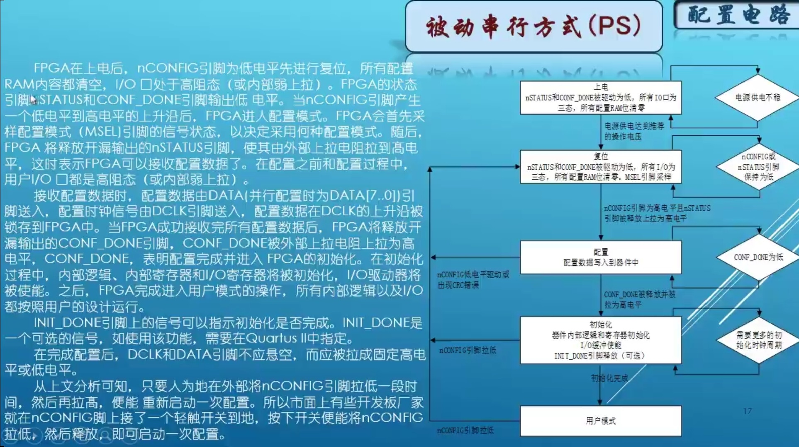
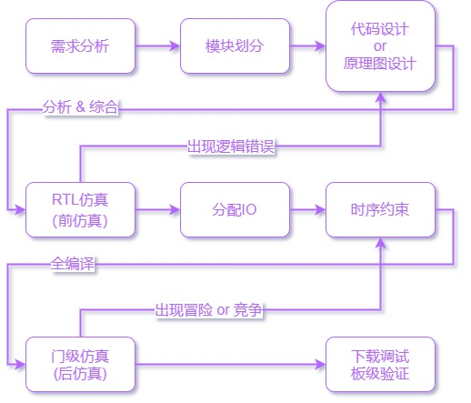
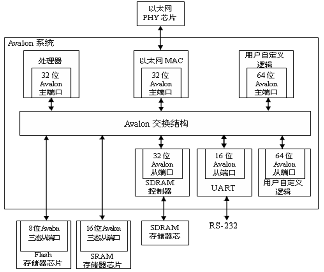
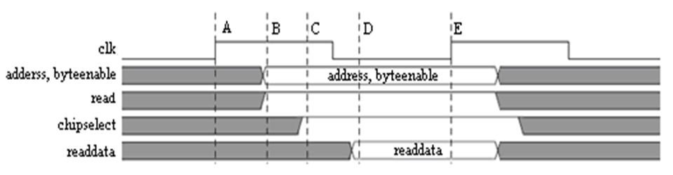

<a rel="license" href="http://creativecommons.org/licenses/by-nc-sa/4.0/"></a>

# HDL & FPGA 学习和规范（HDL-&-FPGA- study）

***p.s 温馨提示：点个 star 收藏一下回头慢慢看；或者下(白)载(嫖)下来，在 Typora 中阅读；[本文知乎地址](https://zhuanlan.zhihu.com/p/356856108) ；整理不易，请多支持。***      

编辑整理 by [Staok](https://github.com/Staok)，始于 2021.2 且无终稿。转载请注明作者及出处。

本文件是“瞰百易”计划的一部分，尽量遵循[“二项玻”定则](https://github.com/Staok/Please-stay-in-the-future)，~~致力于与网络上碎片化严重的现象泾渭分明！~~

本文系广泛撷取、借鉴和整理，适合刚入门的人阅读和遵守，已经有较多经验的人看一看图个乐，如有错误恭谢指出！

本文为简述风格，本意即记录要点和便于快速拾起。

------

## O 目录

[TOC]

------

## 1 HDL & FPGA 值得注意的

### Altera FPGA 基本要素

*p.s 过于基础的概念不提，这不是入门帖。入门可以跳到 “4 值得跟着的学习网站” 章节进行摄入。*

-   FPGA基础资源选择：逻辑单元（LE）数量，内嵌存储器（M9K）数量（总RAM Bits数），乘法器数量，PLL数量，I/O数量，全局时钟网络数量等。

-   板级电路组成：电源，时钟，复位，JTAG，固化配置信息FLASH，外设。具体连接形式参考一些开发板和开源板子的原理图和PCB。

    -   电源：核心电源（标识 VCCINT，低压版本 1.0V，非低压 1.2V），IO BANK（标识 VCCIOx（x = 1到8），电压 1.2V到3.3V），PLL（模拟PLL标识 VCCAx（x = 1、2或4），其地标识 GNDAx（x同前），电压 2.5V；数字PLL标识 VCCD_PLLx（x = 1、2或4），电压1.2V），外设供电。不同系列 FPGA 的供电措施不同，具体要看电器参数等手册，尽量使用推荐值。
    -   复位：上电后，FPGA器件开始加载外部FLASH芯片的固化信息，加载完毕之后（最多0.3s）再进行复位（低电平有效），阻容RC复位电路可选：R=47kΩ，C=10uF，3.3V的IO标准下，充电到1.7V时间为340ms。

-   全局时钟网络：专用时钟网络走线，同一时钟到达不同寄存器的时间差可以被控制到很小的范围内。外部输入时钟信号要连接到“全局时钟专用引脚”上。FPGA的综合工具会自动识别和分配。

-   I/O：输入和输出时钟信号尽量分配到专用引脚上。差分信号对儿必须分配到支持差分的专用引脚上。高速信号分配到支持高速传输的专用引脚上（如DDR的专用IO接口）。一些硬核使用的引脚可能是固定的要注意。总线信号尽量分配到同一个BANK。一些产生噪声干扰的信号（如时钟信号）尽量远离器件的配置喜欢和其它敏感的信号。

- 调试和固化：

  更多详细参考：

  -   [FPGA配置方式](https://www.cnblogs.com/aikimi7/p/3499633.html)。
  -   [FPGA的各种功能管脚](https://tech.hqew.com/fangan_1990801)。
  -   [Altera特殊管脚的使用](https://blog.csdn.net/xhnmn/article/details/85017131)。
  -   官方手册里是最全的、最准的，多看！
  
  具体看官网手册“Cyclone IV Device Handbook Volume 1”的“Configuration Process”章节和“Configuring Altera FPGAs.pdf”手册。
  
  -   调试为通过 JTAG 接口用 Blaster 下载器把编译生成的.sof文件下载到FPGA内掉电易失的SRAM中。
  
  -   固化是通过 JTAG 接口用 Blaster 下载器把编译并转化生成的.jic文件下载到FPGA对于的外部FLASH器件中。FPGA上电从FLASH中获取配置信息，分为几种不同的配置模式，根据 [3:0]MSEL 四个引脚上电时的电平状态确定，而具体的 [3:0]MSEL 与 启动方式的关系 看对应FPGA芯片系列型号的手册。配置模式分为以下几种：
  
      AS（主动串行），适用于小容量。由FPGA器件引导配置过程，EPCS系列FLASH专供AS模式。一般用此模式。
  
      AP（主动并行），速度快，占I/O更多，适用于大容量FPGA器件。EPC系列FLASH用于此。
  
      PS（被动串行），需要外部MCU或CPLD（如MAX II系列）控制FLASH的数据打入FPGA，此方式最灵活，对于多个FPGA或者要自动更换固件用此模式。
  
      
  
      等其他。

### FPGA 开发流程和适用范围

- 开发流程：需求分析，模块划分，实现，前仿真，分配 IO，时钟信号约束 + 其他信号时序分析和约束，后仿真，下载验证和调试，固化代码（注意是有顺序的）。

  

-   FPGA固有灵活性和并行性。FPGA应用领域列举：逻辑粘合，实时控制，高速信号采集和处理，协议实现，仿真验证系统，片上系统SoC。

-   处理器和FPGA分工：MCU、MPU适合做管理、协调，FPGA的数字逻辑适合做专用的、复杂的、结构和功能固定下来的算法实现。

-   推荐多去读读FPGA原厂（Altera 或 Xilinx）的官方文档，在它们的一些文档手册中有各种常见的电路的参考实现实例和代码风格。

-   板级PCB走线遵循“[PCB走线规范](https://github.com/Staok/thoughs-about-hardware-design)”。

-   ...

### 设计和实施规范

这里的规范仅为初级，另有“HuaWei Verilog 规范”等规范可供参考。

#### 顶层设计的要点

1. 单个模块尽量使用一个时钟源；对于多个模块要认真、清楚的划分时钟域；跨时钟域的信号一定做同步处理（D触发器同步）；片内的 PLL / DLL 资源尽量利用起来；至少要对所有时钟信号加上简单的时序约束，不能没有。
2. 数据传递的两边速率不一致要在中间加 FIFO 缓存。
3. 复杂逻辑/时序逻辑要使用 FSM （有限状态机）方式来写，在下面的 “模块收集” 里面有状态机的例子。
4. 条件逻辑/状态图等一定要遍历所有状态，一定，防止不可预料的错误综合结果，对于 if 要有 else，对于 case 要有 default。
5. 对于仿真：先对每一个单个模块仿真，要求代码覆盖率、条件分支覆盖率、表达式覆盖率必须达到 100%，这三个可以通过 Modelsim 查看；子系统仿真，将多个模块组合在一起进行仿真，覆盖率尽量高；系统级仿真，软硬件整板联调。仔细设计仿真激励文件。
6. 通常采用自顶向下的设计方式。先确定系统有哪些输入和输出，把系统划分成多个子功能模块（框图模块），每个功能模块再划分下一层的子模块（HDL 意义上的模块），最后的每个模块的设计对应一个 module ，可以一个 module 设计成一个 verilog HDL 文件。
7. 工程文件夹划分规范：prj 为工程文件存放目录； rtl 为 verilog 可综合代码存放目录； testbench 为测试文件存放目录； img 为设计相关图片存放目录； doc 为设计相关文档存放目录； prj 文件夹下还建立了子文件夹 ip，用于存放 Quartus Prime 中生成的 IP 核文件。  

#### Verilog HDL

##### 语法基础

-   No.1，层次化设计，IP化设计。自写小IP尽量参数化、可重用，方便日后搭建数字积木。

-   顶层文件名与顶层模块名一致。

-   模块的定义名加尾缀"_ module"，输入输出的信号名各加后缀"_ in"和"_ out"，低电平有效的信号加尾缀"_ n"，时钟信号使用"clk _"或"Clk _"前缀，复位信号使用"rst _"前缀，使能信号使用"en"或者"Enable"标识等。

-   定义模块的时候，定义输入输出信号时就带好"input" 、 "output" 和 "reg"的类型修饰。

-   一个 tab 四个空格。

-   用 tab 划分清晰的语句层次，用 tab 对齐多排赋值操作等。

-   begin 和 end 语句块修饰词在竖方向对齐。

-   操作符等前后用一个空格做间隔。

- 注释齐全，对别人负责。

- 以下用一例子包含 verilog 常用语法。

  ```verilog
  /* 这里是注释 */
  // 还是注释
  
  /*
  	Verilog 保留字
  	always  and  assign begin  buf  bufif0 bufif1 case  casex  casez  cmos
      deassign  default defparam  disable edge  else  end  endcase  endmodule
      endfunction  endprimitive  endspecify  endtable  endtask  event
      for  force  forever  fork  function  highz0  highz1  if  ifnone
      initial  inout  input  integer join  large  macrmodule  medium  module
      nand  negedge  nmos  nor  not  notif0  notif1 or  output
      parameter pmos  posedge  primitive  pull0  pull1  pullup pulldown
      rcmos  real  realtime  reg  release repeat rnmos rpmos rtran  rtranif0
      rtranif1  scalared  small  specify specparam  strong0 strong1 supply0 supply1
      table  task  time  trantranif0  tranif1 tri  tri0  tri1  triand  trior
      trireg  vectored  wait  wand  weak0 weak1 while  wire  wor  xnor  xor
  */
  
  /*	引用自 https://blog.csdn.net/luxinwylive/article/details/99827766
  	（1）所有综合工具都支持的结构：always，assign，begin，end，case，wire，tri，aupply0，supply1，reg，integer，default，for，function，and，nand，or，nor，xor，xnor，buf，not，bufif0，bufif1，notif0，notif1，if，inout，input，instantitation，module，negedge，posedge，operators，output，parameter。
  	（2）所有综合工具都不支持的结构：time，defparam，$finish，fork，join，initial，delays，UDP，wait。
  	（3）有些工具支持有些工具不支持的结构：casex，casez，wand，triand，wor，trior，real，disable，forever，arrays，memories，repeat，task，while。
  */
  
  /* wire 类型变量定义物理连线，不保存东西，reg 类型变量定义寄存器，用于保存东西 */
  
  /*
   引自 https://zhuanlan.zhihu.com/p/72012739
   wire 用法总结
      1.wire可以在Verilog中表示任意宽度的单线/总线
      2.wire可以用于模块的输入和输出端口以及一些其他元素并在实际模块声明中
      3.wire不能存储值（无状态），并且不能在always @块内赋值（=或<=）左侧使用。
      4.wire是assign语句左侧唯一的合法类型
      5.wire只能用于组合逻辑
   reg 用法总结
      1. 类似于电线，但可以存储信息（有内存，有状态）允许连接到模块的输入端口，但不能连接到实例化的输出
      2. 在模块声明中，reg可以用作输出，但不能用作输入
      3. 在always@(......)语句块内，= 或者 <= 赋值语句的左边必须是是reg变量
      在initial语句块内，= 赋值语句的左边必须是是reg变量
      4. Reg不能用于assign赋值语句的左侧
      5. 当与@（posedge clock）块一起使用时，reg可用于创建寄存器
      6. reg可用于组合逻辑和时序逻辑
  */
  
  /* 连续赋值语句（assign）用于对线型变量（wire）的赋值，不能够出现在任何一个过程块（begin ... end）中；连续赋值语句（assign）定义组合逻辑，声明物理逻辑的关系；线型变量一旦被连续赋值语句赋值后，赋值语句右端表达式中的信号有任何变化，都将实时地反映到左端的线型变量中 */
  
  /* 过程赋值语句（= 和 <=）完成对寄存器变量（reg）的赋值，只能在过程块语句中被赋值；过程赋值语句只有在语句被执行到时，赋值过程才能够进行一次，而且赋值过程的具体执行时间还受到各种因素的影响 */
  
  /*
  	数据类型：
  	5'o37		5 位八进制数，二进制为 11111
  	10'o37		右对齐，高位补 0
  	10'bx0x1 	左边补 x, x x x x x x x 0 x 1，x 为表未知状态
  	4'b1x_01	4 位二进制数，为 1 x 0 1，下划线方便阅读
  	4'hz  		4 位z(扩展的z) , 即 zzzz，z 表高阻状态
  	parameter SEC_TIME = 48_000_000; 十进制数
  	位长不能够为变量表达式，可以为预编译、parameter 的表达式
  	
  	verilog 中 整形、浮点型等变量相当于 define 或者 parameter 的作用，这里只用 后二者即可了
  	
  	字符串
  	reg [8*14 : 1]Message = "INTERNAL ERROR"; I 为第 1 位，N 为 第 2 位，依此类推
  	
  	数组
  	reg [wordsize : 0]my_memory[arraysize : 0];
  	引用数组某个数的某个位
  	my_memory_1 = my_memory[1];
  	my_memory_1_bit0 = my_memory_1[0];
  	
  	运算;
  	算术运算符(+，-，x，/,%)
  	赋值运算符(=,<=)
  	关系运算符(>,<,>=,<=)
      逻辑运算符(&&,||,!)
      条件运算符(?;)
      位运算符 (~,|,^,&,^~)
      移位运算符(<<,>>)
      拼接运算符({})
  */
  
  /*
  	预编译：
  	
  	宏定义：`define WIDTH 8
  	引用：reg [`WIDTH-1:0] s1;  原样替换
  	
  	`ifdef 宏名 (标识符)
        	程序段1
      `else
        	程序段2
      `endif
  */
  
  
  /**
    *******************************************************************************************************
    * File Name: xxx.v
    * Author: xxx
    * Version: V1.0.0
    * Date: 20xx-xx-xx
    * Brief: xxxxx
    *******************************************************************************************************
    * History
    *		1.Author: xxx
    *		  Date: 20xx-xx-xx
    *		  Mod: xxxxx
    *
    *		2.Author: xxx
    *		  Date: 20xx-xx-xx
    *		  Mod: xxxxx
    *
    *******************************************************************************************************
    */
  
  // *********************************************************************************
  // Project Name :       
  // Author       : xxx
  // Email        : 
  // Blogs        : 
  // File Name    : xxx.v
  // Module Name  :
  // Called By    :
  // Abstract     :
  //
  // CopyRight(c) 2018-2021, xxx Studio.. 
  // All Rights Reserved
  //
  // *********************************************************************************
  // Modification History:
  // Date         By              Version                 Change Description
  // -----------------------------------------------------------------------
  // xxxx/xx/xx    xx       		1.0                     Original
  //  
  // *********************************************************************************
  module example_module
  (
      /*输入信号*/
      input clk_in,             /*时钟输入*/
      input rst_n_in,           /*复位（低有效）信号输入*/
  
      /*输出信号*/
      output reg [7:0]q_out,    /*q 左移位输出，要用语句块赋值，所以定义为 寄存器类型 */
      output reg [7:0]p_out     /*p 右移位输出*/
      
      /* 寄存器组定义 reg [7：0]Mem[0：1] 即 2 个 8 位的 Mem*/
      
      output output_1 = 0,output_2  /* 缺省为 wire 线网类型，可以定义初始值 */
      /* tri 主要用于定义三态的线网 */
      
  );
      /* 常量参数 */
      parameter  bit_7 = 7,bit_8 = 8;
      
      /* 三目运算例子 
      	wire [2:0] Student = Marks > 18 ? Grade_A : Grade_C;
      	assign LR = (LR_select[1] == 1'b1) ? 1'bx : LR_select[0];
      */
     
      /* 时序逻辑定义，对 q 左移位输出*/
      always @(posedge clk_in or negedge rst_n_in)
          begin
              /* 顺序执行 */
              if(!rst_n_in)
                  begin
                      q_out <= 8'bzzZz_0001; /* 总线赋值 */
                  end
              else
                  begin
                      q_out <= { q_out[6:0] , q_out[bit_7] }; /* 位拼接 */
                  end
          end
      
      /*对 p 右移位输出*/
      always @(posedge clk_in or negedge rst_n_in)
          begin
              if(rst_n_in == 1'b0)
                  begin
                      p_out <= 8'b1000_0000;
                  end
              else
                  begin
                      p_out <= { p_out[0] , p_out[7:1] };
                  end
          end
      
      /* 模块例化，建立连接 */
      FA_struct FA1(
           .A (q_out[1]),
           .B (p_out[1]),
  		.C (rst_n_in),
  		.output_1(),	/* 该引脚悬空，如果是模块的输入则变为高阻，如果是输出则弃用 */ 
  		.output_2(output_2)
       );
  	
  endmodule
  
  /* case 语句例子
  case(case_expr)
      case item_expr : procedural_statement;
      . . .
      . . .
      [default:procedural_statement]
  endcase
  */
  
  /* 门级描述组合逻辑电路 */
  module FA_struct
  (
      input A;
      input B;
      input C;
      
  	output output_1;
  	output output_2;
  );
      /* 模块内连线 */
      wire S1, T1, T2, T3;
      
      xor x1 (S1, A, B);
      xor x2 (output_1, S1, C);
      and A1 (T3, A, B );
      and A2 (T2, B, C);
      and A3 (T1, A, C);
      or O1 (output_2, T1, T2, T3 );
      
  endmodule
  
  /*
  	一个参数化模块设计例子
  	定义：
  module Sdram_Write
  #(  parameter   DATA_WIDTH  =   16,		注，#() 这个部分用于模块参数化配置，但不可综合
      parameter   ADDR_WIDTH  =   12,
      parameter   ROW_DEPTH   =   2,
      parameter   COL_DEPTH   =   256,
      parameter   BURST_LENGTH =   4,       //burst length
      parameter   ACT_DEPTH    =  1,
      parameter   BREAK_PRE   =   1
  )
  (
      input                       clk,
      input                       rst_n,
      input                       wr_trig,
      input                       wr_en,
      input                       ref_rq,
      output          reg [3:0]   wr_cmd,
      output          reg [ADDR_WIDTH - 1:0]  wr_addr,
      output                       wr_rq,
      output          reg         wr_end_flag,
      output              [1:0]   wr_bank_addr,
      output              [DATA_WIDTH - 1:0]  wr_data,
      //wfifo
      output                       wfifo_rd_en,
      input              [7:0]    wfifo_rd_data
  );
  	例化：
  Sdram_Write
  #(  .DATA_WIDTH             ('d16),
      .ADDR_WIDTH             ('d12),
      .ROW_DEPTH              ('d1),
      .COL_DEPTH              ('d4),
      .BURST_LENGTH           ('d4),       //burst length
      .ACT_DEPTH              ('d1),
      .BREAK_PRE              ('d1) 
  )
  Sdram_Write_inst(
      .clk                    (clk),
      .rst_n                  (rst_n),
      .wr_trig                (wr_trig),
      .wr_en                  (wr_en),
      .ref_rq                 (ref_rq),
      .wr_cmd                 (wr_cmd),
      .wr_addr                (wr_addr),
      .wr_rq                  (wr_rq),
      .wr_end_flag            (wr_end_flag),
      .wr_bank_addr           (wr_bank_addr),
      .wr_data                (wr_data),
      .wfifo_rd_en            (wfifo_rd_en),
      .wfifo_rd_data          (wfifo_rd_data)
  );
  
  */
  ```

##### 编写规范

-   以时钟信号同步的时序逻辑编写时尽量只用非阻塞赋值"<="（同步执行），用阻塞赋值"="（顺序执行）可能会产生bug，后者一般用于组合逻辑设计。尽量避免使用异步信号（比如异步复位等），即慎用或少用 assign 语句连接逻辑，而尽量把所有逻辑在 always @(*) begin ... end 中实现；如果传入一个异步信号，尽量加寄存器（D触发器）用时钟进行锁存。
-   尽量大部分功能使用时序逻辑电路设计，使用行为语句 + 时序逻辑电路描述（always@ + <=） 完成建模（对于 reg 类型变量）。对于组合逻辑电路描述，简单逻辑可以使用连续赋值语句（assign ）（对于 wire 类型变量），对于复杂组合逻辑使用 always@( 所有敏感信号 ) + = 的语句。
-   从可综合性角度考虑，应慎用各种循环语句（for，while 等），大部分情况下，用于设计的循环语句可以用其他方式所替代。并行块（fork … join）不可综合且容易出现竞争问题，在仿真设计中不建议使用。
-   逻辑表达式不要写的太长，可以简化逻辑（卡诺图法或者公式法，或者 multisim 里面的逻辑分析仪简化逻辑表达式）或者分多行去写，即不要让 RTL 图中某一段逻辑链过于长；长逻辑表达式用括号划分清关系减少歧义。
-   为避免组合逻辑的输出出现“毛刺”，即冒险或竞争的发生，可以在输出加一个寄存器（D触发器），即让输出与时钟同步，当所有信号都到达寄存器（D 触发器）的输入后，时钟再“打一拍”才能输出，这样避免最后的输出有“毛刺”；避免锁存器，使用触发器。
-   case 语句必须带 default 分支，照顾到 case 的所有情况。
-   所有的内部寄存器都应该能够被复位，尽量每个模块都要有时钟同步复位信号（不要用异步复位）。
-   设计逻辑尽量避免不定态 x 或者高阻态 z 进入参与关键逻辑区域，仿真时就注意。
-   移位操作直接用位拼接。
-   同一个信号在很多地方使用，比如参数和时钟等等，应该在每一个用到的地方加一个寄存器（D触发器）用于中继缓冲，避免一个信号扇出信号数量过多。
-   对于有选择和加法、比较等逻辑块，编写时应让信号先经过选择器，再送入乘法器、加法器或比较器等，即“先选后比，先选后加，先选后乘”。面积：乘法器 > 加法器 > 比较器 > 选择器。
-   尽量不要用减法和除法（一个考虑多，一个面积大）；乘以常数直接用“*”，编译器会优化；两变量乘法用硬件乘法器IP。
-   使用 function 函数语句对复杂数值运算打包（它不能包含任何时间控制语句）；函数（function）可以调用其他函数（function）但不能调用任务（task），（function）函数由 任务（task）或其它 module 中调用。使用 task 语句写可重用的、固定下来的组合逻辑（不能有时序逻辑 always，不能有 wire 类型数据，这就是和 module 的区别；任务（task）可以调用其他任务（task）和函数（function），任务（task）只能在 module 中的语句块中被调用）。
-   可以用 generate for 写 同结构不同参数 的 always@(*) 等代码，用 generate if/case 写一些随着需求可变的代码或 IP 核。 generate 语句属于预编译语句。
-   常用的，时钟上升沿锁存数据，时钟下降沿改变数据。

##### 设计技巧

*p.s 以下内容引自 信息理论与技术教研中心 别志松 的 PPT 《复杂数字系统设计的常用技巧》，本文作者又做了一些补充。*

解决速度与面积矛盾的基本原则：1、向关键路径要速度。对于关键路径，可以采用牺牲面积换取速度的方式。2、向非关键路径要面积。对于非关键路径，通过各种方式换取面积。

基本途径：1、EDA工具的约束和优化方式的设置。2、优化代码。以下就是代码优化的一些方法。

**速度的三重定义**

- Throughput：吞吐量
  - 单位时间内能处理的数据量。
  - 常用单位有bit/s，符号/s等。
- Latency：时延
  - 指的是从数据输入到达至相应数据输出之间的时间。
  - 单位是微秒等。
- Timing：时序
  - 指的是时序单元之间的路径所对应的时延。
  - 通常说时序关系不满足一般指触发器间关键路径的最大时延超过目标时钟周期。
  - 标准度量是时钟周期或频率。

**速度的三个方面的折中**

- Latency换Throughput。
- Timing换Throughput。
- Timing换Latency等。

**提高吞吐量的方法**

- 流水线技术

  流水线技术就是把本来只能在一个较长的时钟周期内执行的操作（组合逻辑）分成几步较小的操作，并在多个较高速的时钟内完成。这些步骤的划分是通过多级寄存器来实现的。前级寄存器处理新输入数据的同时，末级寄存器产生老输入数据所对应的输出。

- 多路并行处理

  将耗时较长的电路复制若干份，每份处理部分数据。这种处理方法需要对输入数据进行分解，对输出数据进行合并。主要用于减小 Latency。

**减小延时的主要思想**

- 尽快将数据从输入传递到输出，减小中间过程处理时延，即减少数据处理链的长度。
- 流水线技术不符合低Latency的要求。经常采用的方法：
  - 并行处理。
  - 去掉流水线。
- 减小Latency的代价：有可能减少吞吐量；会造成关键路径时延增大。
- 既要保证Throughput，又要保证较小的Latency，只能采取前述并行处理方法。

**改善时序性能的方法**

即提高最高运行速度。

- 添加中间寄存器层。流水线化。防止中间纯组合逻辑链太长导致延时太长，即防止一个语句特别长运算特别多，所以中间添加寄存器层。

  将多数据的数学运算分为多个运算的组合，这些组合是并行处理的。

- 关键路径改造为并行结构。并行处理。减少串入串出，增加输入和输出的数量，写为并入并出。

- 展平逻辑结构。也是增加并行。

- 减小扇出。

**面积优化方法**

- 精简代码。引用上面“编写规范”一节：
  - 对于有选择和加法、比较等逻辑块，编写时应让信号先经过选择器，再送入乘法器、加法器或比较器等，即“先选后比，先选后加，先选后乘”。面积：乘法器 > 加法器 > 比较器 > 选择器。
  - 不使用除法和减法。等等等等。
- 资源共享。
  - 模块化。声明会被高利用率的寄存器。
  - 等。
- 合理使用复位信号。

“**乒乓操作**”

“乒乓操作”是一个常常应用于数据流控制的处理技巧。数据缓冲模块可以为 单\双口 RAM、FIFO 等。向缓冲区 1 存数据的时候，缓冲区 2 向外出数据，向缓冲区 2 存数据的时候，缓冲区 1 向外出数据，以此循环。


- 乒乓操作的最大特点是通过“输入数据选择单元”和“输出数据选择单元”按节拍、相互配合的切换，将经过缓冲的数据流没有停顿地送到“数据流运算处理模块”进行运算与处理。
- 把乒乓操作模块当做一个整体，站在这个模块的两端看数据，输入数据流和输出数据流都是连续不断的，没有任何停顿，因此非常适合对数据流进行流水线式处理。
- 所以乒乓操作常常与流水线结合使用，完成数据的无缝缓冲与处理。

#### 工程搭建、仿真与时钟约束

##### 一点技巧

-   安装 Quartus II 软件时候关闭杀毒软件。
-   工程路径不能包含中文和空格！
-   自动补全代码的功能 ，在[Tools] -> [Options] -> [Text Editor] -> Autocomplete Text  里面选择启用。
-   对于 Pin Planner，引脚的某一个属性可以复制，然后多选其他 I/O 对应属性的位置，再粘贴实现批量配置。
-   针对硬件引脚固定的项目，先在 Pin Planner 写好所有引脚定义，然后导出，在 Pin Planner 界面里面点 左上角的 File 然后 Export 即可。以后在相同硬件平台创建新工程时可以直接导入这个引脚配置，在 Assignments 里面的 Import Assignments... 导入即可 。
-   综合、布局布线后会生成“报告” ，里面一般会有 Warnings 和 Errors。这些报告信息会辅助你修改你设计中的 bug。
-   三种优化模式（IDE 软件里可选）：针对速度的优化；针对面积的优化；针对功耗的优化。
-   检查 Quartus II 软件对于未使用引脚的处理。步骤：打开 Device -> Device and Pin Options，新打开窗口中找到 Unused Pins，只能选两个比较安全的选项：As input tr-stated with week pull-up 或者 As input tri-stated。

##### ModelSim 仿真

1. 确保 Quartus II 软件中 modelsim 的路径设置正确。步骤：Tools -> Options -> EDA Tool Options 里面，ModelSim-Altera 里面 设置正确路径 `[盘符]:\intelFPGA\18.0\modelsim_ase\win32aloem`。
2. 先对工程做一次全编译。仿真文件 testbench 均由 IDE 软件产生（当引脚很多时节省手写时间）。步骤： Quartus II 软件里面 Processing->Start->Start Test Bench Template Writer，生成 .vt 格式的 testbench 文件后，修改这个文件名与里面顶层模块名一致。
3. 添加仿真文件到 Setting 里的 Simulation 里面（这一步新人可看教程），并设置 testbench 文件 为工程顶层文件。
4. 然后按照下面的样式修改仿真文件。

  一般仿真文件结构：

  ```verilog
  `timescale 1 ns/ 100 ps /* 仿真时间单位和精度 */
  
  /* 设定时钟周期，这里为 20ns，即 50Mhz */
  `define clock_period 20
  
  /* 仿真文件的顶层模块 */
  module xxx_vlg_tst();
  
  // general purpose registers
  reg eachvec; /* 这个必须有。。。 */
  
  /* 这里定义模块内各种 wire 和 net */
  
  /* 这里例化被仿真模块 */
  
  /* 产生时钟 */
  always #(`clock_period/2) clk_in = ~clk_in;
  
  initial
      begin
          $display("Running testbench");
          clk_in = 0; /* 时钟信号初始值 */
          /* 或者用此产生激励源:
          	forever #10 CLK_in = ~CLK_in;    重复运行语句直到仿真结束
          	repeat(100) #5 CLK_in = ~CLK_in; 重复运行语句 100 次
          */
          
          
          
          #1000;
          
          $display("Stop testbench");
          $stop; /* 停止仿真 */
      end
  
  always
  	begin
  		@eachvec; /* 这个必须有。。。 */
  	end
  endmodule
  ```

  打印调试信息：

  ```verilog
  $display("%d",value);   //与 printf 类似，但这个会自动换行
  $wirte("%d\r\n",value);  //与 printf 一样
  // %od,%oh ：以最少位输出，自适应
  // $time 为执行到当前位置的以 `timescale 为单位的时间计数整数；
  // $realtime 为以小数显示的执行到当前位置的以 timescale 为单位的时间。
  ```

  注意：设计仿真文件 testbench 的激励源的时候，对于边沿触发的信号其激励源要设计带有沿变化，否则不会生效。

3. 然后把 仿真文件 设为 工程顶层文件，再 Analysis & Elaboration（分析 测试文件），编译没问题后可以开始仿真了，Tools -> Run Simulation Tool，里面有 RTL 级别仿真（前仿真）和 门级仿真（后仿真）。

4. ModelSim 软件自动打开和仿真并结束后，右边可以查看信号逻辑时序图，通过 “+” 或 “-” 按钮进行放大和缩小视图，左边可以手动增减信号。

##### 时钟信号约束

1. 对于时钟信号的约束，必须要做，最基本要做的是使用 “TimeQuest timing Analyzer” 把设计内的所有时钟信号（包括晶振输入的时钟和 PLL 时钟）都约束一下。以下是具体步骤。

   关于其他输入、输出引脚的约束以及外接器件的 Timing 约束比较深奥（内容多，但不难理解），更多内容可详看 “3 时序分析和约束” 一节。

2. 打开 Timing Analyzer，新建一个 sdc 文件。以下两个步骤是 根据设置生成 sdc 约束文件，里面是约束的命令语句。

3. 选择菜单栏 Netlist -> Create Timing Netlist，弹出对话框保持默认（保持选择 Post-fit），确认后下一个对话框添加要约束的时钟，在 Targets 选择 Quartus II 工程里面的 一个时钟信号，然后填入 Clock name（随意，可与 工程内时钟信号名保持一致），Period 为该时钟的周期，如实填写，上升下降时间都保持默认为 0 即可，再点 Run。关闭对话框。

4. 左边 Task 栏里面 依次双击 Update Timing Netlist 和 Write SDC File，第二个是保存 sdc 文件，选择一个合适的文件名和位置。然后可以关闭 Timing Analyzer。

5. 在 Quartus II 工程中添加自己生成的 sdc 文件，点击 Assignments -> Settings 里面的 Timing Analyzer，添加上面生成的 sdc 文件，关闭。可以看到 Quartus II 工程中 File 多了该 sdc 文件。然后对 Quartus II 工程 全编译。

6. 再进入 Timing Analyzer，找到左边 Task 栏下面 Macros 里面的 Report All Core Timing，双击打开，可以在右边栏看到 综合布线后各个信号线的传递裕量（Slack），为从小到大配列，该值为正的即可，越大越好。左边的其他栏目可以看到建立时间、保持时间的裕量等更多信息。

##### 记录 QII 的 IP 核使用

**NCO 正弦波合成**

- 时间和幅值精度可设，运行时不可调。
- 频率、相位运行时可调。
- 概念参考 `/额外文档/nco原理.docx`。
- 使用参考 [使用Quartus 18.0 的NCO ip核产生一个正弦信号，并用modelsim仿真（解决asj文件not define 问题）_guorui的博客-CSDN博客](https://blog.csdn.net/qq_44554964/article/details/110880830)。

**ALTDDIO_IN**

- 双速率时钟同步数据采集，即在时钟的上、下沿采集数据。
- 参考好文 [IP之ALTDDIO_in仿真 - 中国的孩子 - 博客园 (cnblogs.com)](https://www.cnblogs.com/zhongguo135/p/7683723.html)。
- 参考好文 [双倍数据速率I/O (ALTDDIO_IN、ALTDDIO_OUT和ALTDDIO_BIDIR) IP内核用户指南 (intel.cn)](https://www.intel.cn/content/www/cn/zh/programmable/documentation/eis1415168884929.html)。
- ALTDDIO_OUT 和 ALTDDIO_BIDIR 与之同理。

**ALTPLL**

使用 FPGA 内 PLL 资源做 预先自定义的频率、相位的时钟信号，一个 PLL 最多输出 五路。

- 可选的 带有 复位端（areset） 和 锁相成功指示端（locked） 等。

- 一个 实例化 例子如下。

  ```verilog
  pll pll_inst
  (
      .areset ( !rst_n_in ),      //高电平输入复位 PLL
      .inclk0 ( CLK_50M_in ),
      .c0 ( pll_out_10k ),
      .c1 ( pll_out_1M ),
      .c2 ( pll_out_100M ),
      .locked ( pll_out_locked )  //高电平输出表明 PLL 开始正常工作
  );
  ```

**Qsys 中的 SDRAM 使用**

[IP介绍和使用](https://blog.csdn.net/qq_43445577/article/details/107375619)，软核中的使用例程如下（默认16位数据位）。

```c
 /* 写 *(ram_base) = i;  读 *(ram_base)*/
unsigned short * ram_base = (unsigned short *)(SDRAM_0_BASE+0x10000);
```

#### Nios II 相关

-   关于 SOPC，Nios II Eclipse 里面的 BSP 包里的 drives 文件夹里面的 _reg 后缀 的 .h 文件里面为自加的 Nios II 外设的可调用的 API。
-   Nios II 默认禁止中断嵌套。
-   关于 Nios II software build tool for eclipse 这个 IDE 的设置 和 程序固化：

    -   file->new->Nios II ...Template 从 .sopcinfo 文件获取信息新建 hello world 模板项目，工程名暂定为 Temp。
    -   把 需要 include 放入编译路径的其他程序文件分好文件夹，都放入 工程文件夹 Temp 里面，并把含有主函数 main() 的 .c 文件替换默认生成的 Hello World.c 文件。
    -   在 IDE 中，右击工程名 Temp，Nios II->BSP Editor，选择里面 enable_reduced... 和 enable_small_c 这两个选项，再点右下角的 Generate，并关闭。
    -   在 IDE 中，右击工程名 Temp，选 Properties，在 Nios II App.. Path 里面的 App include directories 里面添加需要 include 的其他程序文件夹。
    -   在 IDE 中，右击工程名 Temp，选 New->Source Folder，把同上一步的文件夹添加进来；然后右击工程名 Temp，选 Refresh。
    -   开始编译，在 IDE 中，右击工程名 Temp，选 Build Project，成功后再 Make Targets->Build，里面选 mem_init_generate  ，再点 Build。
    -   然后再把 mem_init 文件夹里面的 meminit.qip 文件到 Quartus 工程中，再全编译产生一个 .sof 文件，进而转 .jic 文件进行固化。
-   其他：若在 IDE 里面 Run 或者 Debug 时候显示 “make:[../..._bsp-recurs-make-lib] Error 2” 错误，则在 IDE 中，右击工程名 Temp，Nios II->BSP Editor，再点一下右下角的 Generate，并关闭重新编译，Run，即可。
-   SOPC 的 Nios 2 处理器构建时（Qsys 或 SOPC Builder里面）可以只加 RAM（不用 ROM）（RAM 大小：经验值至少大于10KB）（这里的 RAM 是 FPGA 里面的 M9K 存储器，不是外接 RAM 芯片的）来运行程序。当外设较多时，Nios 2 的底层驱动 HAL 库非常大，对于储存空间紧张的 FPGA 用 RAM + ROM 会资源不够，所以只用 RAM 且设置足够大。Nios 2 processer 设置复位和中断向量均在 RAM 里面。在 Quartus II 里面把逻辑和 Nios II software build tool for eclipse 生成的 Nios 2 程序文件 .qip 一同全编译产生 .sof 后，再转换成 .jic 文件进行固化。
-   SOPC系统构建（Qsys 或 SOPC Builder里面）还是得尽量添加 EPCS 存储器件 (如果板子只有一个 EPCS Flash（一般都是一个），那就是与 FPGA 存放逻辑共用的那个存储器件 )控制器和 SRAM （或 SDRAM）控制器（板子上要有至少一个 RAM 芯片），否则只靠 FPGA 的片上存储空间写 Nios II 程序，那么能写的程序太少了（HAL 库就占了非常多容量），非常受限。
-   每一个外设尽量封装成 Avalon 接口的 IP 核，加入到 Nios II 的外设中；IP 核的设计分为三个层次，Avalon 接口层，寄存器层和逻辑层（输出层），Nios II 软件只需操作/读写 IP 核的寄存器组即可控制该 IP 核所有功能。
-   创建自定义 IP 核一个详细教程 [Quartus创建自定义IP核 - LED控制IP核_欢迎光临-CSDN博客](https://blog.csdn.net/tq384998430/article/details/84988888)。
-   ...

### 更多小技巧教程文章

-   [关于Quartus II工程综合时间过长问题的解决](https://blog.csdn.net/love_ljq/article/details/78576919)。
-   [四步搞定NiosII工程路径改变](http://blog.sina.com.cn/s/blog_bff0927b0102uy30.html)。
-   [PIO时序混乱问题解决（遇到再看）](http://blog.sina.com.cn/s/blog_bff0927b01014gxc.html)。
-   [NIOS知识 和 各种错误解决](https://www.cnblogs.com/philips-lu/archive/2012/04/30/2476641.html)。
-   [你问我FIFO有多深？](https://zhuanlan.zhihu.com/p/58833510) 结论：在SDRAM的应用中，我们通常使用的读写FIFO是突发长度的2倍，比如突发长度为256，那FIFO的深度设置为512，使得FIFO始终保持半满的状态。可以保证数据的传输。
-   [【小梅哥FPGA进阶教程】MC8051软核在FPGA上的使用](https://www.cnblogs.com/xiaomeige/p/6403094.html)。
-   [（教程基于小梅哥）FPGA配置MC8051IP软核](https://blog.csdn.net/quansirx/article/details/105143773)。
-   [NingHeChuan](https://ninghechuan.com/) 网友个人博客 有许多 FPGA 分享。
-   ...


------

## 1.1 Avlon 总线

Intel FPGA Avalon 总线，其灵活特点有：

-   时钟同步的；分主、从信号线和时序，主外设能发起传输；多主多从；
-   主、从时钟频率可不同，位宽可不同；
-   专用的地址总线、数据总线和控制总线，支持高达 1024 位的数据宽度、不是 2 的偶数幂的数据宽度；
-   高性能，易实现，占用资源少，开放使用。
-   多种模式，时延和时序可调整，定制外设 IP 核超级灵活。

若只使用 Quartus II 的 Qsys 自带的定制的 Avalon 总线外设构建SOPC系统，不需了解 Avalon 总线，因为这些自带外设的接口都已经写好了 Avalon 总线，在图形化连接总线时，就是在把各个外设的从 Avalon 接口挂载到 Nios II 的主 Avalon 总线上；若采用用户定制外设构建 SOPC 系统，所开发外设必须符合 Avalon 总线规范，需要熟悉 Avalon 总线。下图为典型 Avalon 架构。下图最右面上下两个外设框分别为用户自定义主端口和用户自定义从端口。



Avalon 主端口发起对 Avalon 总线的传输，Avalon 从端口响应来自 Avalon 总线的传输。主从端口对即在某次数据传输过程中，通过 Avalon 总线连接起来的主端口和从端口。

### 定制 外设 IP 核的框架


### 从端口传输

#### 从端口信号类型

*p.s 其中前九个最常用；不带 "_ n" 后缀的都是高电平有效；还有流水线信号、突发信号、三态信号和流控信号等，没有列出。*

*p.s 不带任何读写功能的、最基本信号：clk、reset_n、chipselect、address 四个，即下表中的前四个。*

*p.s address 地址的信号宽度最好都设置为 32 位宽，地址对齐的时候一一对应，最简便。*

*p.s Avalon 接口规范没有对Avalon外设的信号指定命名规则；Avalon 外设的信号的名字可以与信号类型名相同，也可以遵循 用户 / 系统级的命名规则。*

*p.s 下表只列基本信号，其它如流水线信号、突发信号、流控制信号、三态信号等不予列出。*

| 信号类型        | 信号宽度             | 方向 | 功能和使用描述                                               |
| --------------- | -------------------- | ---- | ------------------------------------------------------------ |
| **clk**         | 1                    | IN   | Avalon从端口的同步时钟，所有信号必须与clk同步，异步外设可以忽略clk信号。 |
| **reset_n**     | 1                    | IN   | 从外设复位信号。该信号有效时，从外设进入确定的复位状态。     |
| **chipselect**  | 1                    | IN   | Avalon从端口的片选信号。                                     |
| **address**     | 1~32                 | IN   | Avalon从端口的地址线，指定了从外设地址空间的字的地址偏移，要访问外设寄存器的地址，从0x00开始。 |
| **read**        | 1                    | IN   | 读从端口的请求信号。若使用了该信号，则必须使用readdata或data信号。 |
| **readdata**    | 1~1024               | OUT  | 读传输时，输出到Avalon总线的数据线。若使用了该信号，则data信号不能使用。 |
| **write**       | 1                    | IN   | 写从端口的请求信号。若使用了该信号，必须使用writedata或data信号，writebyteenable信号不能使用。 |
| **writedata**   | 1~1024               | IN   | 写传输时，来自Avalon总线的数据线。若使用了该信号，data信号不能使用。 |
| **waitrequest** | 1                    | OUT  | 若从端口不能立即响应Avalon总线，用该信号来暂停Avalon总线。用于可变等待周期模式。 |
| irq_n           | 1                    | OUT  | 从外设的中断请求信号。                                       |
| byteenable      | 2,4,6,8,16,32,64,128 | IN   | 按字节寻址访问使能信号。在对宽度大于8位的存储器进行写传输时，该信号用于选择特定的字节段。若使用了该信号，writedata信号必须使用，writebyteenable信号不能使用。 |
| writebyteenable | 2,4,6,8,16,32,64,128 | IN   | 该信号是byteenable信号和write信号的逻辑与操作。write和byteenable信号不能使用。 |
| Begin transfer  | 1                    | IN   | 在每次传输的第一个周期内有效，使用用法取决于具体外设。       |

32位从端口的 byteenable 信号功能定义表如下。

| byteenable[3..0] | 写操作             |
| ---------------- | ------------------ |
| 1111             | 全 32 位写操作     |
| 0011             | 2 个低字节的写操作 |
| 1100             | 2 个高字节的写操作 |
| 0001             | 字节 0 的写操作    |
| 0010             | 字节 1 的写操作    |
| 0100             | 字节 2 的写操作    |
| 1000             | 字节 3 的写操作    |

IN （输入）类型的信号都是 Avalon 总线进行置位，从端口不能对其操作，从端口只能操作 OUT （输出）类型的信号。

主端口信号类型表略。

#### 从端口传输模式列举

-   基本单周期读写时序传输。固定等待周期的读写传输；可变等待周期的读写传输（个人推荐常用）。（只对从端口有）
-   具有建立时间和保持时间的固定等待周期的读写传输（用于异步外设，了解）。（只对从端口有）
-   流水线读传输（带固定延迟和可变延迟）。
-   流控制时序传输。
-   三态时序传输。
-   突发时序传输。

下面分别列举时序图。可以看时序图直接上手编写逻辑，但提醒还是先多参考参考，熟悉广泛使用的成熟的编写架构和思路。

#### 基本单周期读写传输

**读时序：**



A 沿为主端口发起 读传输，E 沿 为主端口取走要读的数据；在 E 沿之前从端口的外设必须提前在 readdata 数据线上准备好数据。

基本读传输适用于异步从外设，只要外设被选中或地址发生变化，外设就立刻返回数据。readdata须在下一个时钟上升沿之前保持稳定。

从端口通常在 检测到 clk 上升沿后，再检测 chipselect 和 read 两个信号同时为高时，就认为一次读传输。

基本读传输适用于异步从外设，只要外设被选中或地址发生变化，外设就立刻返回数据。readdata 须在下一个时钟上升沿之前保持稳定。

**写时序：**


A 沿为主端口发起 写传输，E 沿为主端口准备好要写的数据，在此沿从端口外设要取走数据。基本写传输适用于片内同步外设。

从端口通常在 检测到 clk 上升沿后，再检测 chipselect 和 write 两个信号同时为高时，就认为一次读传输。

基本写传输适用于片内同步外设。

#### 固定等待周期的读写传输

读传输：等待周期允许从端口使用一个或多个时钟周期来捕获地址和/或返回有效readdata，等待周期会影响从端口的吞吐量。

写传输：等待周期允许从端口使用一个或多个时钟周期来捕获地址和writedata，等待周期会影响从端口的吞吐量。 

用于同步外设访问，读传输等待周期是必须的，写传输非必须。

在 Qsys 中导入定制 IP 核时，可设要等待的固定周期，读和写时序的等待周期是一样的。

**读时序：**


**写时序：**


**固定等待周期写传输的一个例子：**

OLED 定制外设 IP 的部分源码，从端口的写传输实现，VHDL；第二个图是软件设置固定等待周期数，要与源码中的一致。


#### 可变等待周期的读写传输（推荐）

读传输：等待周期允许从端口使用一个或多个时钟周期来捕获地址和/或返回有效readdata，等待周期会影响从端口的吞吐量。

写传输：等待周期允许从端口使用一个或多个时钟周期来捕获地址和writedata，等待周期会影响从端口的吞吐量。

可变等待周期采用 waitrequest 信号实现，看时序图就容易明白。从端口必须在第一个总线时钟周期内设置 waitrequest 有效，直到从端口处理好数据再置 waitrequest 信号无效，然后总线在下一个时钟上升沿捕获数据，结束本次传输。

**读时序：**


**写时序：**


**可变等待周期写传输的一个例子：**

OLED 定制外设 IP 的部分源码，从端口的写传输实现，VHDL。


#### 具有建立时间和保持时间读写传输

具有建立时间和保持时间的固定等待周期的读写传输，用于异步外设，了解。

具有建立时间和固定等待周期的从端口读传输，对于片外从端口异步外设，在主端口发出 read 有效信号之前，需要地址和 chipselect 等信号先稳定一段时间，然后将 read 信号置位有效，这样异步外设可以在 read 上升沿开始根据其他信号做出反应，而不会引起冒险竞争，因为在 read 上升沿时其他信号均已稳定。可以设置固定等待周期。即**具有建立时间、固定等待周期的读传输**（建立时间和可变等待周期不能同时采用）。下图中，上面的时序图，Tsu 即建立时间。

具有建立时间和保持时间的从端口写传输，对于片外从端口异步外设，在主端口发出 write 有效信号之前，需要 address、byteenable、writedata 和 chipselect 信号保持几个周期的稳定时间。即**具有建立时间、固定等待周期、保持时间的写传输**。下图中，下面的时序图，C 沿到 E 沿 之间的时间 即建立时间，E 沿到 F 沿 之间的时间 即保持时间。

端口读传输和写传输的建立时间必须相同。

对于一些 ram 等芯片的时序，设置的当可以把 Avalon 总线 直连 此类芯片的总线接口，即该从端口时序通常用于片外外设。


“建立时间、固定等待周期和保持时间” 属性在 Qsys 中设置；端口读传输和写传输的建立时间必须相同；建立时间和可变等待周期不能同时采用。

### 主端口传输

#### 主端口信号类型

*p.s Avalon 主端口必须有三个信号：clk、address、waitrequest。*

*p.s 下表只列基本信号，其它如流水线信号、突发信号、流控制信号、三态信号等不予列出。*

| 信号类型        | 信号宽度                    | 方向 | 必需 | 功能及使用描述                                               |
| --------------- | --------------------------- | ---- | :--- | ------------------------------------------------------------ |
| **clk**         | 1                           | In   | Yes  | Avalon**主端口的同步时钟，**  所有的信号必须与**clk同步。**  |
| **waitrequest** | 1                           | In   | Yes  | 迫使主端口等待，  直到**Avalon总线准备好处理传输。**         |
| **address**     | 1~32                        | Out  | Yes  | 从**Avalon主端口到Avalon总线的地址线。**  表示的是**一个字节的地址，**  主端口只发出字边界的地址。 |
| read            | 1                           | Out  | No   | 主端口的读请求信号。  主端口不执行读传输时不需要该信号。  若使用了该信号，**readdata或data信号线必须使用**。 |
| readdata        | 8,16,32,64,128,256,512,1024 | In   | No   | 读传输时，来自**Avalon总线的数据线。**  当主端口不执行读传输时，不需要该信号。  若使用了该信号，**read信号必须使用，data信号不能使用。** |
| write           | 1                           | Out  | No   | 主端口的写请求信号，不执行写传输时不需要该信号。**使用该信号，writedata或data信号必须使用。** |
| writedata       | 8,16,32,64,128,256,512,1024 | Out  | No   | 写传输时，到Avalon交换架构的数据线。当主端口不执行写传输时，不需要该信号。**使用该信号，write信号必须使用，data信号不能使用。** |
| byteenable      | 2,4,6,8,16,32,64,128        | Out  | No   | 字节使能信号。在对宽度大于8位的存储器进行写传输时，该信号用于选择特定的字节段。读传输时，主端口必须置所有的byteenable信号线有效。 |
| Irq             | 1,32                        | In   | No   | 中断请求信号。  如果**Irq信号是一个32位的矢量信号，那么它的每一位直接对应一个从端口上的中断信号；**如果**Irq是一个单比特信号，那么它是所有从外设的Irq信号的逻辑或，中断优先级irqnumber信号确定。** |
| irqnumber       | 6                           | In   | No   | 在**irq信号为单比特信号时，使用irqnumber信号来确定外设的中断优先级。**  Irqnumber**的值越小，所代表的中断优先级越高。** |
| reset           | 1                           | In   | No   | 全局复位信号。实现跟外设相关。                               |
| resetrequest    | 1                           | Out  | No   | 允许外设将整个**Avalon系统复位。**                           |

#### 主端口传输模式列举与参数说明

主端口传输模式列举：

-   单 / 可变等待周期 的读写传输。
-   流水线读传输（带可变延迟）。
-   流控制时序传输；
-   三态时序传输；
-   突发时序传输。

主端口的等待周期、建立时间、保持时间属性：

- 等待周期：主端口使用waitrequest信号接受Avalon总线的不确定等待周期。主端口被动地支持可变等待周期，不支持固定等待周期。
- 建立时间和保持时间：主端口不使用建立和保持时间属性。若一个目标从外设有建立和/或保持时间属性，Avalon总线管理主从端口对的信号时序的转换。

#### 主端口 单/可变周期 的读传输

**主端口 单等待周期 的读传输**

主端口在 clk 上升沿后紧接着 设置目标外设地址 address 和 置 read 有效，**等待 waitrequst 信号失效** 便可从 readdata 取数据。


**主端口 可变等待周期 的读传输**


#### 主端口 单/可变周期 的写传输

**主端口 单等待周期 的写传输**


**主端口 可变等待周期 的写传输**


### 其它 Avalon 传输

这里略。

- 流水线读传输。
- 流控制时序传输；
- 三态时序传输；
- 突发时序传输。
- 中断与复位，地址对齐等内容。

------

## 2 模块收集（不定期更新）

*p.s 以下为列举日常项目中用到的可以开源的部分模块源码（Verilog or VHDL）或者实现思想（就是留个坑，但还没写）。*

-   [Github 上有哪些优秀的 Verilog/FPGA 项目？](https://www.zhihu.com/question/348990787) 有很多好的推荐项目和回答！

-   [Alex Forencich 的 GitHub 主页](https://github.com/alexforencich) 开源了许多 Verilog IP，[Verilog IP cores - Alex Forencich](http://www.alexforencich.com/wiki/en/verilog/start)。

-   [FreeCores (github.com)](https://github.com/freecores) A home for open source hardware cores。

-   [pConst / basic_verilog 的常用代码](https://github.com/pConst/basic_verilog)。

    文件位置：./pConst 的 basic_verilog-master.zip

-   [Analog Devices, Inc](https://github.com/analogdevicesinc)。

-   [OpenCores](https://opencores.org/)。

-   [李锐博恩 Verilog编程实例](https://www.zhihu.com/column/c_1251279662770712576)。

-   [NingHeChuan 的 ip_lib ——构建自己的IP库，搭建起你的数字积木](https://github.com/NingHeChuan/Digital_Front_End_Verilog/tree/master/ip_lib)。

    文件位置：./FPGA学习和规范 的参考源码/NingHeChuan 的 ip_lib/

-   类MCU的时间片轮询实现，晶振时钟通过PLL IP得到准确时钟，每个PLL有五个输出，分别分频得到运行周期为 10MHz、5MHz、1MHz、1KHz、100Hz的程序的入口，把不同功能的程序直接放在想要按照某个周期运行的程序入口即可。这个直接写到模板的Top文件即可，不用作为一个模块。

-   根据寄存器或者外部引脚的电平组合等信息，可以在运行时任设或者有限改动FPGA内部逻辑的输出引脚，就像STM32的外设引脚切换或者K10的FPIOA一样允许用户将255个内部功能映射到芯片外围的48个自由IO上。

- 按键消抖

  思想：~~当“按键可以检测标志位”有效时，按下的边沿触发启动一计数器，同时标记“按键可以检测标志位”失效，当计数器计数到一定值后，再检测按键是否处于按下状态，如果是则标记“按键有效”标志位做输出，如果不是则停止计数，同时标记“按键可以检测标志位”有效，同时清空计数值。~~ 

  sopc 读取外部按键设计思路，引脚输入后先在FPGA的逻辑上先实现一个去抖，然后把无毛刺的稳定的信号传给 nios ii 输入脚，然后 nios ii 里面实现一个外部引脚沿中断。

  文件位置：./FPGA学习和规范 的参考源码/按键消抖/

-   特定序列检测与发送

    思想：用 case 语句实现简单的一段状态机即可。

-   PWM信号产生

    思想：占空比值与一个向上计数器计数值比较，当占空比值比计数值大时输出高电平，小时输出低电平。

    参考“小梅哥 AC620V2开发板配套资料”的无源蜂鸣器章节和例程。

-   I2C模块

    [小梅哥 FPGA进阶 第十六章 IIC协议详解+UART串口读写EEPROM](https://www.cnblogs.com/xiaomeige/p/6509414.html)

-   SPI模块

    

-   UART模块
    看《FPGA设计-实战演练（逻辑篇）》 吴厚航 的随书源码。（@TODO 不过这个程序的最外层还不够明朗，需要再整理简化使用）
    
-   状态机

    注意点：
    
    -   关键是画好状态图；
    -   状态完备；
    -   组合逻辑条件完备；
    -   不能进入死循环；
    -   不能进入非预知状态。
    -   需要穷举所有状态对应的输出动作，或者使用 default 来定义未定义状态动作。
    -   推荐都使用三段式状态机。
    
    参考：
    
    -   文件位置：./FPGA学习和规范 的参考源码/fsm/
    -   三种状态机 [基于FPGA的有限状态机浅析](https://www.cnblogs.com/ninghechuan/p/7898297.html)
    -   三段式状态机 [万物基于状态机——状态机大法好](https://zhuanlan.zhihu.com/p/137890103)
    -   三段式状态机 [【BUG记录】三段式状态机编写问题及三段式状态机各部分功能分析](https://zhuanlan.zhihu.com/p/337903913)
    
-   

-   ...

------

## 2.5 数字电路设计实用技术

《硬件架构的艺术：数字电路的设计方法与技术》，该书的译者序：“...实用且有效...作者系统打造出一栋由实用技术组成的大厦......一切从解决问题出发，解释怎么做，并给出原理图和代码，以及解决方案......本书主要内容涉及**时钟和复位、多时钟域设计、时钟分频器、低功耗设计技术、流水线技术、字写顺序、消抖技术和电磁兼容性等内容**”。该书针对以上方面给出了很多设计策略和实用方法，或者说对很多模块的设计给出了推荐的 HDL 和电路，适合当作工具书手办阅读。该书罗列了很多应该避免的有隐患的（甚至仿真的时候不容易发现而实际运行时候容易出问题的种种情况）综合后的数字逻辑电路，并由此给出了很多应该避免的 HDL 写法，以及查看综合后电路是否有已知的隐患；并也给出了推荐的数字电路形式。该书在网上容易下载到电子版。


------

## 3 时序分析和约束

参考源：

-   [FPGA 高级设计：时序分析和收敛](https://zhuanlan.zhihu.com/p/345848164)。
-   [小梅哥概述时序约束和分析相关知识](https://www.bilibili.com/video/BV1ZE411f78z) 视频。
-   [小梅哥FPGA时序分析和约束实例演练课程](https://www.bilibili.com/video/BV1NE411h7qP) 视频。
-   [基于TimeQuest Timing Analyzer的时序分析笔记（一） - 程序员大本营 (pianshen.com)](https://www.pianshen.com/article/87231741320/) 网络系列文章。
-   《深入浅出玩转FPGA第三版》 时序分析章节 书。
-   《通向FPGA之路---七天玩转Altera之时序篇V1.0》书。


------

## 4 值得跟着的学习网站

-   SOC FPGA 和 FPGA 等各种开发板开源资料（网上可以找到全套资料）：如 正点原子、野火、黑金、Allegro等开发板（考验资料搜集能力的时候到了）。
-   [小梅哥 B站视频（Verilog & FPGA基础，SOPC，SOC以及其他常用协议](https://space.bilibili.com/476579378) 缺点：视频太~长了。
-   [LeiWang1999/FPGA: 帮助大家进行FPGA的入门，分享FPGA相关的优秀文章，优秀项目 (github.com)](https://github.com/LeiWang1999/FPGA) 记录比较全面

文档形式的教程：

-   [Quartus II的奇幻漂流V1.0——手把手教你使用Quartus II](http://blog.sina.com.cn/s/blog_bff0927b0102v0u3.html)
-   [Nios II的奇幻漂流V2.0——基于Qsys的Nios II设计教程](http://blog.sina.com.cn/s/blog_bff0927b0102uzmh.html)
-   [Nios II入门实验](https://www.cnblogs.com/yuphone/category/276816.html)
-   [小梅哥 FPGA资料专区](http://www.corecourse.cn/forum.php?mod=forumdisplay&fid=41)
-   [小梅哥 - 博客园](https://www.baidu.com/link?url=CYD8ZBPmHJP4lnc7VKOm_uIU55a5sTGQWKyKYCixBTbitt-DLiyDpbSK0VhrnSSJ&wd=&eqid=9dea342a00000a8400000006603cb8f7)
-   [HDL & FPGA 学习和规范（HDL-&-FPGA- study）](https://github.com/Staok/HDL-FPGA-study-and-norms)

FPGA的时序分析和时序约束的资料参考：

- [FPGA 高级设计：时序分析和收敛](https://zhuanlan.zhihu.com/p/345848164)
- [小梅哥概述时序约束和分析相关知识](https://www.bilibili.com/video/BV1ZE411f78z)
- [小梅哥FPGA时序分析和约束实例演练课程](https://www.bilibili.com/video/BV1NE411h7qP)
- 《深入浅出玩转FPGA第三版》 时序分析章节
- 《通向FPGA之路---七天玩转Altera之时序篇V1.0》

学习路线总结文章：

- [如何学习FPGA，FPGA学习教程学习经验 - 知乎 (zhihu.com)](https://zhuanlan.zhihu.com/p/406835323)
- 

------

## 5 参考

*p.s 本文一部分来自自己总结的经验，一部分来自参考。参考不是照搬，是选择我认为的精髓，每个人不同，所以推荐看一下这些参考，TA们都提供了很好的技巧。当然也许还有很多更好的资料，可以留言推荐。*

*p.s 正文中某些段落内容的旁边已经加注了参考和引用源，这里列出剩下的引用源。*

-   [《FPGA设计-实战演练（逻辑篇）》 吴厚航](http://www.tup.com.cn/bookscenter/book_06045601.html#) 在“资源下载”栏可下载随书课件和源码。
-   [知乎 硅农](https://www.zhihu.com/people/ninghechuan)。
-   [Verilog设计的原则和技巧和IP核的使用](https://blog.csdn.net/dengshuai_super/article/details/52528407)。
-   《基于FPGA的嵌入式开发与应用（徐光辉 程东旭 等编著）》。
-   还可以参考但还没看的：
    - 《FPGA设计-实战演练（高级技巧篇）》王敏志
    - ...
-   ...