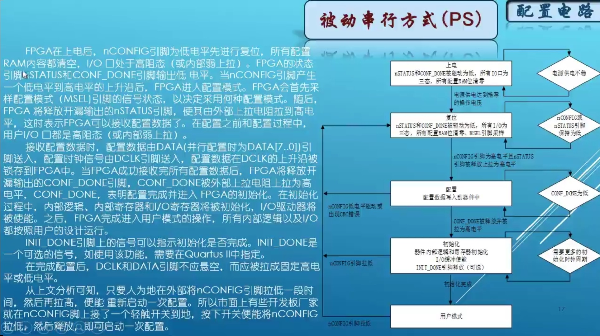
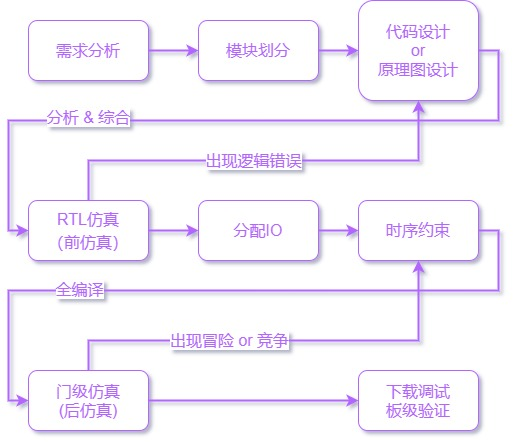

# HDL & FPGA 学习和规范（HDL-&-FPGA- study）

***p.s 温馨提示：点个 star 收藏一下回头慢慢看；或者下(白)载(嫖)下来，在 Typora 中阅读；[本文知乎地址](https://zhuanlan.zhihu.com/p/356856108) ；整理不易，请多支持。***      

编辑整理 by [Staok](https://github.com/Staok)，始于 2021.2 且无终稿。转载请注明作者及出处。

本文件是“瞰百易”计划的一部分，尽量遵循[“二项玻”定则](https://github.com/Staok/Please-stay-in-the-future)，~~致力于与网络上碎片化严重的现象泾渭分明！~~

本文系广泛撷取、借鉴和整理，适合刚入门的人阅读和遵守，已经有较多经验的人看一看图个乐，如有错误恭谢指出！

------

## O 目录

[TOC]

------

## 1 HDL & FPGA 值得注意的

### FPGA基本概念

*p.s 过于基础的概念不提，这不是入门帖。入门可以跳到 “4 值得跟着的学习网站” 章节进行摄入。*

-   FPGA固有灵活性和并行性。FPGA应用领域列举：逻辑粘合，实时控制，高速信号采集和处理，协议实现，仿真验证系统，片上系统SoC。

-   FPGA基础资源选择：逻辑单元（LE）数量，内嵌存储器（M9K）数量（总RAM Bits数），乘法器数量，PLL数量，I/O数量，全局时钟网络数量等。

-   板级电路组成：电源，时钟，复位，JTAG，固化配置信息FLASH，外设。具体连接形式参考一些开发板和开源板子的原理图和PCB。

    -   电源：核心电源（标识 VCCINT，低压版本 1.0V，非低压 1.2V），IO BANK（标识 VCCIOx（x = 1~8），电压 1.2V~3.3V），PLL（模拟PLL标识 VCCAx（x = 1~2或4），其地标识 GNDAx（x同前），电压 2.5V；数字PLL标识 VCCD_PLLx（x = 1~2或4），电压1.2V），外设供电。

-   全局时钟网络：专用时钟网络走线，同一时钟到达不同寄存器的时间差可以被控制到很小的范围内。外部输入时钟信号要连接到“全局时钟专用引脚”上。FPGA的综合工具会自动识别和分配。

-   复位：上电后，FPGA器件开始加载外部FLASH芯片的固化信息，加载完毕之后（最多0.3s）再进行复位（低电平有效），阻容RC复位电路可选：R=47kΩ，C=10uF，3.3V的IO标准下，充电到1.7V时间为340ms。

-   I/O：输入和输出时钟信号尽量分配到专用引脚上。差分信号对儿必须分配到支持差分的专用引脚上。高速信号分配到支持高速传输的专用引脚上（如DDR的专用IO接口）。一些硬核使用的引脚可能是固定的要注意。总线信号尽量分配到同一个BANK。一些产生噪声干扰的信号（如时钟信号）尽量远离器件的配置喜欢和其它敏感的信号。

-   调试和固化：

    具体看官网手册“Cyclone IV Device Handbook Volume 1”的“Configuration Process”章节和“Con€guring Altera FPGAs.pdf”手册。

    -   调试为通过 JTAG 接口用 Blaster 下载器把编译生成的.sof文件下载到FPGA内掉电易失的SRAM中。

    -   固化是通过 JTAG 接口用 Blaster 下载器把编译并转化生成的.jic文件下载到FPGA对于的外部FLASH器件中。FPGA上电从FLASH中获取配置信息，分为几种不同的配置模式，根据 [3:0]MSEL 四个引脚上电时的电平状态确定。配置模式分为以下几种：

        AS（主动串行），适用于小容量。由FPGA器件引导配置过程，EPCS系列FLASH专供AS模式。一般用此模式。

        AP（主动并行），速度快，占I/O更多，适用于大容量FPGA器件。EPC系列FLASH用于此。

        PS（被动串行），需要外部MCU或CPLD（如MAX II系列）控制FLASH的数据打入FPGA，此方式最灵活，对于多个FPGA或者要自动更换固件用此模式。

        

        等其他。

-   板级PCB走线遵循“PCB走线规范”。（TODO，这里引用我总结的PCB规范全网收集梳理并简约化）

-   开发流程：

    

-   推荐多去读读FPGA原厂（Altera 或 Xilinx）的官方文档，在它们的一些文档手册中有各种常见的电路的参考实现实例和代码风格。

-   三种优化模式：针对速度的优化；针对面积的优化；针对功耗的优化。

-   ...

### 操作和编写规范

这里的规范仅为初级，另有“HuaWei Verilog 规范”等规范可供参考。

-   No.1，层次化设计，IP化设计。自写小IP尽量参数化、可重用，方便日后搭建数字积木。

-   顶层文件名为“Top.v”，顶层模块名也为"top"。

-   模块的定义名加尾缀"_ module"，输入输出的信号名各加后缀"_ in"和"_ out"，低电平有效的信号加尾缀"_n"。

-   定义模块的时候，定义输入输出信号时就带好"input" 、 "output" 和 "reg"的类型修饰。

-   一个 tab 四个空格。

-   用 tab 划分清晰的语句层次，用 tab 对齐多排赋值操作等。

-   begin 和 end 语句块修饰词在竖方向对齐。

-   操作符等前后用一个空格做间隔。

-   注释齐全，对别人负责。

-   以时钟信号同步的时序逻辑编写时尽量只用非阻塞赋值"<="，用阻塞赋值"="可能会产生bug，后者一般用于组合逻辑设计。尽量避免使用异步信号（比如异步复位等），即慎用或少用 assign 语句连接逻辑，而尽量把所有逻辑在 always @(*) begin ... end 中实现；如果传入一个异步信号，尽量加寄存器（D触发器）用时钟进行锁存。

-   逻辑表达式不要写的太长，可以简化逻辑（卡诺图法或者公式法，或者 multisim 里面的逻辑分析仪简化逻辑表达式）或者分多行去写，即不要让RTL图中某一段逻辑链过于长；长逻辑表达式用括号划分清关系减少歧义。

-   为避免组合逻辑的输出出现“毛刺”，即冒险或竞争的发生，可以在输出加一个寄存器（D触发器），即让输出与时钟同步，当所有信号都到达寄存器（D触发器）的输入后，时钟再“打一拍”才能输出，这样避免最后的输出有“毛刺”；避免锁存器，使用触发器。

-   case 语句必须带 default 分支，照顾到 case 的所有情况。

-   移位操作直接用位拼接。

-   同一个信号在很多地方使用，比如参数和时钟等等，应该在每一个用到的地方加一个寄存器（D触发器）用于中继缓冲，避免一个信号扇出信号数量过多。

-   对于有选择和加法、比较等逻辑块，编写时应让信号先经过选择器，再送入乘法器、加法器或比较器等，即“先选后比，先选后加，先选后乘”。面积：乘法器 > 加法器 > 比较器 > 选择器。

-   尽量不要用减法和除法（一个考虑多，一个面积大）；乘以常数直接用“*”，编译器会优化；两变量乘法用硬件乘法器IP。

-   使用 function 函数语句对复杂运算打包，由 task 或其他语句调用；使用 task 函数语句写可重用的、固定下来的组合逻辑（不能有时序逻辑 always，这就是和 module 的区别，并且 task 只能在语句块中被调用）。

    ```verilog
    /*____________________________________________
     * 模块简述：...
     ____________________________________________*/
    module example_module
        (
                    /*输入信号*/
                    input clk_in,             /*时钟输入*/
                    input rst_n_in,           /*复位（低有效）信号输入*/
        
                    /*输出信号*/
                    output reg [7:0]q_out,    /*q 左移位输出*/
                    output reg [7:0]p_out     /*p 右移位输出*/
        );
        
        /*对 q 左移位输出*/
        always @(posedge clk_in or negedge rst_n_in)
            begin
                if(!rst_n_in)
                    begin
                        q_out <= 8`b0000_0001;
                    end
                else
                    begin
                        q_out <= { q_out[6:0] , q_out[7] };
                    end
            end
        
        /*对 p 右移位输出*/
        always @(posedge clk_in or negedge rst_n_in)
            begin
                if(!rst_n_in)
                    begin
                        p_out <= 8`b1000_0000;
                    end
                else
                    begin
                        p_out <= { p_out[0] , p_out[7:1] };
                    end
            end
    	
    endmodule
    ```

-   工程路径不能包含中文和空格！

-   自动补全代码的功能 ，在[Tools] -> [Options] -> [Text Editor] -> Autocomplete Text  里面选择启用。

-   工程文件夹划分规范：prj 为工程文件存放目录； rtl 为 verilog 可综合代码存放目录； testbench 为测试文件存放目录； img 为设计相关图片存放目录； doc 为设计相关文档存放目录； prj 文件夹下还建立了子文件夹 ip，用于存放 Quartus Prime 中生成的 IP 核文件。  

-   仿真文件 testbench 均由IDE软件产生（当引脚很多时节省手写时间）。先做一次全编译，然后 Quartus II 软件里面 Processing->Start->Start Test Bench Template Writer，生成 .vt 格式的 testbench 文件后，修改这个文件名与里面顶层模块名一致。

    仿真文件常用语句：

    产生时钟：

    ```verilog
    `define clock_period 20 	//周期20ns，50Mhz
    
    always #(`clock_period/2) CLK_in = ~CLK_in;	//周期20ns，50Mhz
    ```

    暂停仿真，在需要仿真结束的地方加：`$stop;`

    打印调试信息：

    ```verilog
    $display("%d",value);   //与 printf 类似，但这个会自动换行
    $wirte("%d\r\n",value);  //与 printf 一样
    %od,%oh ：以最少位输出，自适应
    $time 为执行到当前位置的以 `timescale 为单位的时间计数整数；
    $realtime 为以小数显示的执行到当前位置的以 timescale 为单位的时间。
    ```

    注意：设计仿真文件 testbench 的激励源的时候，对于边沿触发的信号其激励源要设计带有沿变化，否则不会生效。

-   设计逻辑尽量避免不定态x或者高阻态z进入参与关键逻辑区域，仿真时就注意。

-   在“Device and Pin Options”里面“Dual-Purpose Pins”里面把所有复用功能的引脚都设置为“Use as regular I/O”，即在复位并配置完之后作为程序用引脚。

-   对于 Pin Planner，引脚的某一个属性可以复制，然后多选其他 I/O 对应属性的位置，再粘贴实现批量配置。

-   可以用 generate for 写 同结构不同参数 的 always@(*) 等代码，用 generate if/case 写一些随着需求可变的代码或IP核。我觉得 generate 语句相当于预编译的作用。

-   关于时序约束，必须要做，最基本要做的是使用“TimeQuest timing Analyzer”把设计内的所有时钟信号（包括晶振输入的时钟和PLL时钟）都约束一下。关于其他输入输出引脚的约束以及外接器件的Timing约束非常深，有待看小梅哥关于时序约束章节的视频学习。

    在quartus工程中添加自己生成的sdc文件：点击 Assignments \ Settings\TimeQuest Timing Analyzer，在这个对话框中，将生成的sdc文件添加到自己的工程里。

-   关于 SOPC，Nios II Eclipse 里面的 BSP 包里的 drives 文件夹里面的 _reg 后缀 的.h 文件里面为自加的 Nios II 外设的可调用的 API。

-   关于 Nios II software build tool for eclipse 这个 IDE 的设置 和 程序固化：

    -   file->new->Nios II ...Template 从 .sopcinfo 文件获取信息新建 hello world 模板项目，工程名暂定为 Temp。
    -   把 需要 include 放入编译路径的其他程序文件分好文件夹，都放入 工程文件夹 Temp 里面，并把含有主函数 main() 的 .c 文件替换默认生成的 Hello World.c 文件。
    -   在 IDE 中，右击工程名 Temp，Nios II->BSP Editor，选择里面 enable_reduced... 和 enable_small_c 这两个选项，再点右下角的 Generate，并关闭。
    -   在 IDE 中，右击工程名 Temp，选 Properties，在 Nios II App.. Path 里面的 App include directories 里面添加需要 include 的其他程序文件夹。
    -   在 IDE 中，右击工程名 Temp，选 New->Source Folder，把同上一步的文件夹添加进来；然后右击工程名 Temp，选 Refresh。
    -   开始编译，在 IDE 中，右击工程名 Temp，选 Build Project，成功后再 Make Targets->Build，里面选 mem_init_generate  ，再点 Build
    -   然后再把 mem_init 文件夹里面的 meminit.qip 文件到 Quartus 工程中，再全编译产生一个 .sof 文件，进而转 .jic 文件进行固化。
    -   其他：若在 IDE 里面 Run 或者 Debug 时候显示 “make: *** [../..._bsp-recurs-make-lib] Error 2” 错误，则在 IDE 中，右击工程名 Temp，Nios II->BSP Editor，再点一下右下角的 Generate，并关闭重新编译，Run，即可。

-   ...

### 其他小技巧

-   [关于Quartus II工程综合时间过长问题的解决](https://blog.csdn.net/love_ljq/article/details/78576919)
-   [四步搞定NiosII工程路径改变](http://blog.sina.com.cn/s/blog_bff0927b0102uy30.html)
-   [PIO时序混乱问题解决（遇到再看）](http://blog.sina.com.cn/s/blog_bff0927b01014gxc.html)
-   [NIOS知识 和 各种错误解决](https://www.cnblogs.com/philips-lu/archive/2012/04/30/2476641.html)
-   [你问我FIFO有多深？](https://zhuanlan.zhihu.com/p/58833510) 结论：在SDRAM的应用中，我们通常使用的读写FIFO是突发长度的2倍，比如突发长度为256，那FIFO的深度设置为512，使得FIFO始终保持半满的状态。可以保证数据的传输。
-   [【小梅哥FPGA进阶教程】MC8051软核在FPGA上的使用](https://www.cnblogs.com/xiaomeige/p/6403094.html)
-   [（教程基于小梅哥）FPGA配置MC8051IP软核](https://blog.csdn.net/quansirx/article/details/105143773)
-   ...

------

## 2 用到的模块（不定期更新）

*p.s 以下为列举日常项目中用到的可以开源的部分模块源码（Verilog or VHDL）或者实现思想（就是留个坑，但还没写）。*

-   [李锐博恩 Verilog编程实例](https://www.zhihu.com/column/c_1251279662770712576)

-   [NingHeChuan 的 ip_lib ——构建自己的IP库，搭建起你的数字积木](https://github.com/NingHeChuan/Digital_Front_End_Verilog/tree/master/ip_lib)

    文件位置：./FPGA学习和规范 的参考源码/NingHeChuan 的 ip_lib/

-   类MCU的时间片轮询实现，晶振时钟通过PLL IP得到准确时钟，每个PLL有五个输出，分别分频得到运行周期为 10MHz、5MHz、1MHz、1KHz、100Hz的程序的入口，把不同功能的程序直接放在想要按照某个周期运行的程序入口即可。这个直接写到模板的Top文件即可，不用作为一个模块。

-   根据寄存器或者外部引脚的电平组合等信息，可以在运行时任设或者有限改动FPGA内部逻辑的输出引脚，就像STM32的外设引脚切换或者K10的FPIOA一样允许用户将255个内部功能映射到芯片外围的48个自由IO上。

-   按键消抖

    思想：~~当“按键可以检测标志位”有效时，按下的边沿触发启动一计数器，同时标记“按键可以检测标志位”失效，当计数器计数到一定值后，再检测按键是否处于按下状态，如果是则标记“按键有效”标志位做输出，如果不是则停止计数，同时标记“按键可以检测标志位”有效，同时清空计数值。~~ 

    文件位置：./FPGA学习和规范 的参考源码/按键消抖/

-   特定序列检测与发送

    思想：用 case 语句实现简单的一段状态机即可。

-   PWM信号产生

    思想：占空比值与一个向上计数器计数值比较，当占空比值比计数值大时输出高电平，小时输出低电平。

    参考“小梅哥 AC620V2开发板配套资料”的无源蜂鸣器章节和例程。

-   I2C模块

    [小梅哥 FPGA进阶 第十六章 IIC协议详解+UART串口读写EEPROM](https://www.cnblogs.com/xiaomeige/p/6509414.html)

-   SPI模块

    

-   UART模块
看《FPGA设计-实战演练（逻辑篇）》 吴厚航 的随书源码。（@TODO 不过这个程序的最外层还不够明朗，需要再整理简化使用）
    
-   状态机

    注意点：
    
    -   关键是画好状态图；
    -   状态完备；
    -   组合逻辑条件完备；
    -   不能进入死循环；
    -   不能进入非预知状态。
    -   需要穷举所有状态对应的输出动作，或者使用 default 来定义未定义状态动作。
    -   推荐都使用三段式状态机。
    
    参考：
    
    -   文件位置：./FPGA学习和规范 的参考源码/fsm/
    -   三种状态机 [基于FPGA的有限状态机浅析](https://www.cnblogs.com/ninghechuan/p/7898297.html)
    -   三段式状态机 [万物基于状态机——状态机大法好](https://zhuanlan.zhihu.com/p/137890103)
    -   三段式状态机 [【BUG记录】三段式状态机编写问题及三段式状态机各部分功能分析](https://zhuanlan.zhihu.com/p/337903913)
    
-   

-   ...

    

------

## 3 时序分析和约束

参考源：

-   [FPGA 高级设计：时序分析和收敛](https://zhuanlan.zhihu.com/p/345848164)
-   [小梅哥概述时序约束和分析相关知识](https://www.bilibili.com/video/BV1ZE411f78z)
-   [小梅哥FPGA时序分析和约束实例演练课程](https://www.bilibili.com/video/BV1NE411h7qP)

FPGA白书从P105开始。


------

## 4 值得跟着的学习网站

-   各种开发板开源资料（网上可以找到全套资料）：如 正点原子、野火、黑金、Allegro等开发板（考验资料搜集能力的时候到了）。
-   [小梅哥 B站视频（Verilog & FPGA基础，SOPC，SOC以及其他常用协议](https://space.bilibili.com/476579378) 缺点：视频太~长了。
-   [小梅哥 时序约束专讲](https://www.bilibili.com/video/BV1jE411v7H3)

以下是文档形式的教程

-   [Quartus II的奇幻漂流V1.0——手把手教你使用Quartus II](http://blog.sina.com.cn/s/blog_bff0927b0102v0u3.html)
-   [Nios II的奇幻漂流V2.0——基于Qsys的Nios II设计教程](http://blog.sina.com.cn/s/blog_bff0927b0102uzmh.html)
-   [Nios II入门实验](https://www.cnblogs.com/yuphone/category/276816.html)
-   [小梅哥 FPGA资料专区](http://www.corecourse.cn/forum.php?mod=forumdisplay&fid=41)
-   [小梅哥 - 博客园](https://www.baidu.com/link?url=CYD8ZBPmHJP4lnc7VKOm_uIU55a5sTGQWKyKYCixBTbitt-DLiyDpbSK0VhrnSSJ&wd=&eqid=9dea342a00000a8400000006603cb8f7)
-   [HDL & FPGA 学习和规范（HDL-&-FPGA- study）](https://github.com/Staok/HDL-FPGA-study-and-norms)

------

## 5 参考

*p.s 本文一部分来自自己总结的经验，一部分来自参考。参考不是照搬，是选择我认为的精髓，每个人不同，所以推荐看一下这些参考，TA们都提供了很好的技巧。当然也许还有很多更好的资料，可以留言推荐。*

-   《FPGA设计-实战演练（逻辑篇）》 吴厚航
-   [知乎 硅农](https://www.zhihu.com/people/ninghechuan)
-   [Verilog设计的原则和技巧和IP核的使用](https://blog.csdn.net/dengshuai_super/article/details/52528407)
-   ...